Once the application is running and you sign in with the Admin role, the Admin Settings page becomes the main place to configure the product without editing environment variables directly.

<section class="latest-release-card-grid">
  <article class="latest-release-card">
    
<i class="bi bi-brush"></i>

    <h2>General</h2>
    
Brand the app, tune appearance, manage landing-page content, and control global behavior such as file limits and system prompts.

  </article>
  <article class="latest-release-card">
    
<i class="bi bi-cpu"></i>

    <h2>Models and retrieval</h2>
    
Configure GPT, embeddings, image generation, Azure AI Search, Document Intelligence, and enhanced citations from the same settings surface.

  </article>
  <article class="latest-release-card">
    
<i class="bi bi-people"></i>

    <h2>Workspaces and agents</h2>
    
Enable personal, group, and public workspaces, define classification behavior, and manage agent and action capabilities.

  </article>
  <article class="latest-release-card">
    
<i class="bi bi-speedometer"></i>

    <h2>Safety, scale, and logging</h2>
    
Turn on Content Safety, Redis, Front Door, Application Insights logging, and other controls that matter once the deployment grows up.

  </article>
</section>

  <h2>Best starting point</h2>
  
The Setup Walkthrough is the fastest way to move a fresh environment from partially configured to usable. It guides admins through the critical dependencies in the right order and skips steps that do not apply.

  <h2>Need to change what users see first?</h2>
  
Use the <a href="{{ '/how-to/admin_ui_settings/' | relative_url }}">branding, home page, and support settings how-to</a> for step-by-step guidance on logos, application title, landing page text, health checks, Swagger, classification banners, Support, external links, and system settings.

## Setup Walkthrough

The Admin Settings page includes an interactive **Setup Walkthrough** feature that guides you through the initial configuration process. This is particularly helpful for first-time setup.

### Starting the Walkthrough

- The walkthrough automatically appears on first-time setup when critical settings are missing
- You can manually launch it anytime by clicking the **"Start Setup Walkthrough"** button at the top of the Admin Settings page
- The walkthrough will automatically navigate to the relevant configuration tabs as you progress through each step

### Walkthrough Features

- **Automatic Tab Navigation**: As you move through steps, the walkthrough automatically switches to the relevant admin settings tab and scrolls to the appropriate section
- **Smart Step Skipping**: Steps that aren't applicable based on your configuration choices (e.g., workspace-dependent features) are automatically skipped
- **Real-time Validation**: The "Next" button becomes available only when required fields for the current step are completed
- **Progress Tracking**: Visual progress bar shows your completion status through the setup process
- **Flexible Navigation**: Use "Previous" and "Next" buttons to move between steps, or close the walkthrough at any time to configure settings manually

### Walkthrough Steps Overview

The walkthrough covers these key configuration areas in order:

1. **Application Basics** (Optional) - App title and logo
2. **GPT API Settings** (Required) - Azure OpenAI GPT endpoint and authentication
3. **GPT Model Selection** (Required) - Select available GPT models for users
4. **Workspaces** (Optional) - Enable personal and/or group workspaces
5. **Embedding API** (Required if workspaces enabled) - Configure embedding service
6. **Azure AI Search** (Required if workspaces enabled) - Configure search indexing
7. **Document Intelligence** (Required if workspaces enabled) - Configure document processing
8. **Video Support** (Optional, workspace-dependent) - Configure video file processing
9. **Shared Speech Service** (Optional) - Configure the shared Speech resource used for audio uploads, voice input, and voice responses
10. **Content Safety** (Optional) - Configure content filtering
11. **User Feedback & Archiving** (Optional) - Enable feedback and conversation archiving
12. **Enhanced Features** (Optional) - Enhanced citations and image generation

The walkthrough automatically adjusts which steps are required based on your selections. For example, if you don't enable workspaces, embedding and search configuration steps become optional.

## Configuration Sections

Key configuration sections include:

### 1. General
- **Branding**: Application title, custom logo upload (light and dark mode), favicon
- **Home Page Text**: Landing page markdown content with alignment options and optional editor
- **Appearance**: Default theme (light/dark mode) and navigation layout (top nav or left sidebar)
- **Health Check**: External health check endpoint configuration for monitoring systems
- **API Documentation**: Enable/disable Swagger/OpenAPI documentation endpoint
- **Classification Banner**: Security classification banner for data sensitivity indication
- **External Links**: Custom navigation links to external resources with configurable menu behavior
- **System Settings**: Maximum file size, conversation history limit, default system prompt

For practical operator steps, see [Configure Branding, Home Page, and Support Settings]({{ '/how-to/admin_ui_settings/' | relative_url }}).

### 2. AI Models
- **Chat Model**:
  - Configure Azure OpenAI endpoint(s) for chat models
  - Supports Direct endpoint or APIM (API Management)
  - Allows Key or Managed Identity authentication
  - Test connection button
  - Select multiple active deployment(s) - users can choose from available models
  - Multi-model selection for users

- **Embeddings Configuration**:
  - Configure Azure OpenAI endpoint(s) for embedding models
  - Supports Direct/APIM, Key/Managed Identity
  - Test connection
  - Select active deployment

- **Image Generation** *(Optional)*:
  - Enable/disable feature
  - Configure Azure OpenAI DALL-E endpoint
  - Supports Direct/APIM, Key/Managed Identity
  - Test connection
  - Select active deployment

### 3. Workspaces
- **Personal Workspaces**: Enable/disable "Your Workspace" (personal docs)
- **Group Workspaces**:
  - Enable/disable "Groups" (group docs)
  - Option to enforce `CreateGroups` RBAC role for creating new groups
- **Public Workspaces**:
  - Enable/disable "Public" (public docs)
  - Option to enforce `CreatePublicWorkspaces` RBAC role for creating new public workspaces
- **File Sharing**:
  - Enable/disable file sharing capabilities between users and workspaces.
- **Metadata Extraction**:
  - Enable/disable metadata extraction from documents
  - Select the GPT model used for extraction
- **Multi-Modal Vision Analysis**:
  - Enable vision-capable models for image analysis in addition to document OCR
  - Automatic filtering of compatible GPT models (GPT-4o, GPT-4 Vision, etc.)
- **Document Classification**:
  - Enable/disable classification features
  - Define custom classification labels and colors
  - Dynamic category management with inline editing

### 4. Citations
- **Standard Citations**: Basic text references (always enabled)
- **Enhanced Citations**:
  - Enable/disable enhanced citation features
  - Configure Azure Storage Account Connection String or Service Endpoint with Managed Identity
  - Store original files for direct reference and preview

### 5. Safety
- **Content Safety**:
  - Enable/disable content filtering
  - Configure endpoint (Direct/APIM)
  - Key/Managed Identity authentication
  - Test connection
- **User Feedback**:
  - Enable/disable thumbs up/down feedback on AI responses
- **Admin Access RBAC**:
  - Option to require `SafetyViolationAdmin` role for safety violation admin views
  - Option to require `FeedbackAdmin` role for feedback admin views
- **Conversation Archiving**:
  - Enable/disable conversation archiving instead of permanent deletion

### 6. Search & Extract
- **Azure AI Search**:
  - Configure connection (Endpoint, Key/Managed Identity)
  - Support for Direct or APIM routing
  - Test connection
- **Document Intelligence**:
  - Configure connection (Endpoint, Key/Managed Identity)
  - Support for Direct or APIM routing
  - Test connection
- **Multimedia Support** (Video/Audio uploads):
  - **Video Files**: Configure Azure Video Indexer with the App Service system-assigned managed identity
    - Cloud / Endpoint Mode, Resource Group, Subscription ID, Account Name, Location, Account ID
    - Effective API Endpoint, ARM API Version, Timeout
    - Video Indexer API keys are not used by the current setup flow
  - **Shared Speech Service**: One Speech resource powers audio uploads, speech-to-text input, and text-to-speech
    - Endpoint, Location/Region, Locale, Authentication Type
    - Key authentication uses the Speech key
    - Managed identity uses the custom-domain Speech endpoint; voice responses also require the Speech Resource ID

### 7. Agents
- **Agents Configuration**:
  - Enable/disable Semantic Kernel-powered agents
  - Configure workspace mode (per-user vs global agents)
  - Agent orchestration settings (single agent vs multi-agent group chat)
  - Manage global agents and select default/orchestrator agent
- **Actions Configuration**:
  - Enable/disable core plugins (Time, HTTP, Wait, Math, Text, Fact Memory, Embedding)
  - Configure user and group plugin permissions
  - Manage custom OpenAPI plugins

### 8. Scale
- **Redis Cache**:
  - Enable distributed session storage for horizontal scaling
  - Configure Redis endpoint and authentication (Key or Managed Identity)
  - Test connection
- **Front Door**:
  - Enable Azure Front Door integration
  - Configure Front Door URL for authentication flows
  - Supports global load balancing and custom domains

### 9. Logging
- **Application Insights Logging**:
  - Enable global logging for agents and orchestration
  - Requires application restart to take effect
- **Debug Logging**:
  - Enable/disable debug print statements
  - Optional time-based auto-disable feature
  - Warning: Collects tokens and keys during debug
- **File Processing Logs**:
  - Enable logging of file processing events
  - Logs stored in Cosmos DB file_processing container
  - Optional time-based auto-disable feature

## Admin Settings Execution Guide

Use this section when you need to configure an area, validate it, and know what to check after saving. Open **Admin Settings**, select the named tab, make the change, use the local test buttons where the tab provides them, then click **Save Settings**.

### General

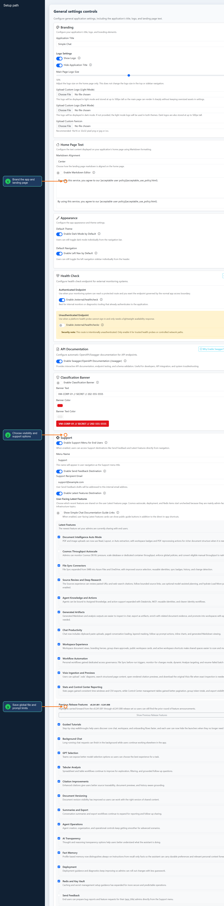

1. Open **General** and set the app title, light/dark logos, favicon, home page Markdown, default theme, and default navigation layout.
2. Configure operational visibility: authenticated and unauthenticated health checks, Swagger/OpenAPI, classification banner, Support menu, Latest Features visibility, and external links.
3. Set global system behavior such as file size limits, conversation history, and the default system prompt, then save and refresh the home page to confirm branding and navigation changes.

### AI Models

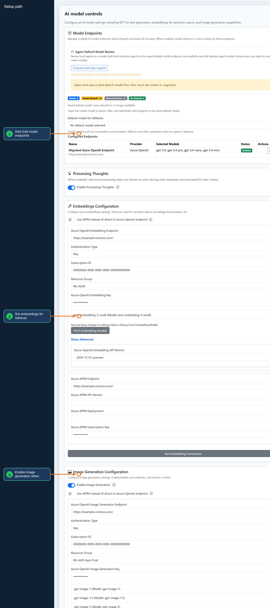

1. Open **AI Models** and add the chat model endpoint configuration: direct Azure OpenAI, Foundry (classic), New Foundry, or APIM endpoint, authentication type, deployment names, and any default model choices. For managed identity or service principal RBAC setup, see [Configure Model Endpoint Identity]({{ '/how-to/model_endpoint_identity_setup/' | relative_url }}).
2. Configure **Embeddings** before enabling retrieval-backed workspace features, then use the connection test to verify the endpoint and authentication path.
3. Enable **Processing Thoughts** and **Image Generation** only for deployments where users should see reasoning traces or generate images, then save and confirm the model selector appears in chat.

### Agents And Actions

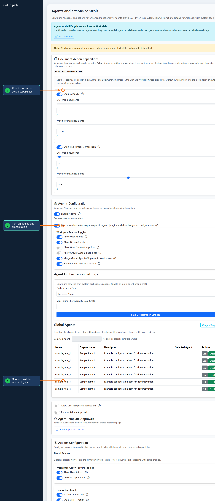

1. Open **Agents and Actions** and choose whether document actions such as Analyze and Document Comparison should appear in Chat and Workflow action menus.
2. Enable agents, choose workspace-specific or global mode, set orchestration behavior, and manage global agents or approvals if admins curate shared agents centrally.
3. Enable action scopes and core plugins users are allowed to invoke. Save global agent/action changes, restart the web app when the tab notes it is required, and then verify the runtime action menus.

### Logging

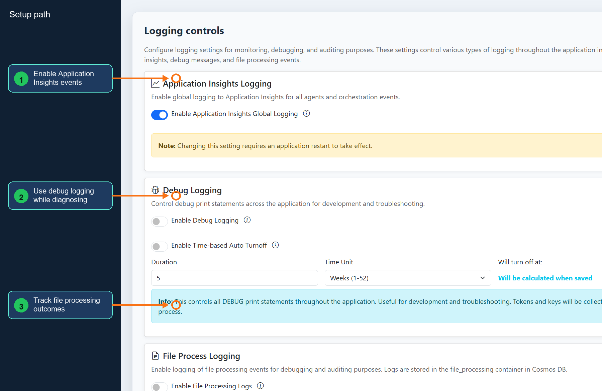

1. Open **Logging** and enable Application Insights logging when agent, orchestration, or operational events should flow into Azure monitoring.
2. Use **Debug Logging** for short diagnosis windows only, set an auto-disable time, and avoid leaving token or key capture enabled longer than necessary.
3. Enable **File Processing Logs** when admins need upload, extraction, indexing, or sync troubleshooting history, then save and confirm the expected log container or telemetry stream receives events.

### Scale

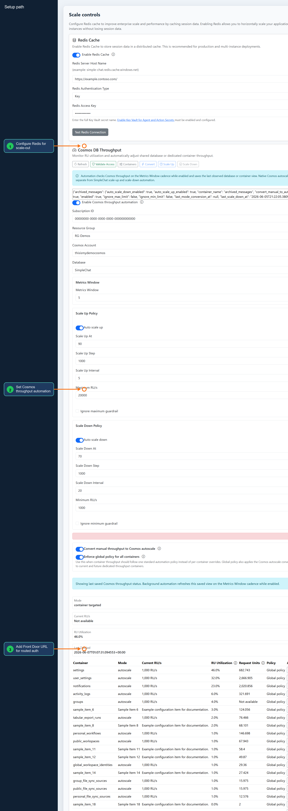

1. Open **Scale** and configure Redis when the app will run multiple instances or needs distributed session storage; test the Redis connection before saving.
2. Use the Cosmos throughput card to refresh status, choose database or container scope, set autoscale thresholds, enforce global policy when appropriate, and convert eligible manual throughput to native autoscale.
3. Configure Azure Front Door when authentication redirects and user-facing URLs should use the routed domain, then save and validate sign-in through the Front Door URL.

### Control Center

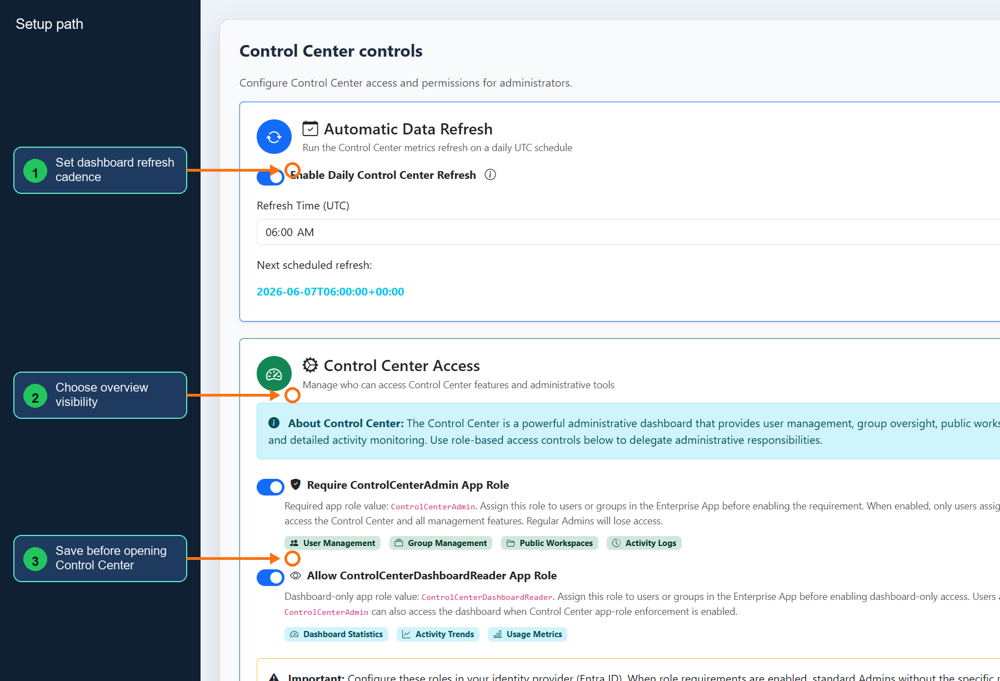

1. Open **Control Center** and set the auto-refresh interval used by dashboard and management views.
2. Choose which overview behavior should be available to admins, especially in larger deployments where refresh frequency affects load.
3. Save the settings, open Control Center, and confirm the dashboard refresh cadence and management tables behave as configured.

### Workspaces

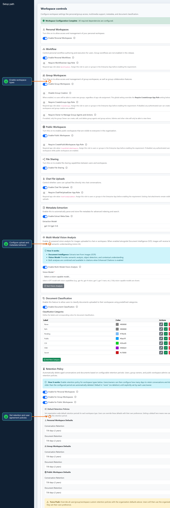

1. Open **Workspaces** and enable the workspace types your users should see: personal, group, public, workflow, and file sharing options.
2. Configure upload behavior, chat file uploads, metadata extraction, multimodal vision, document classification, and any group or public workspace role requirements.
3. Set retention policies, workspace scope lock, and user agreement text, then save and verify the corresponding workspace navigation and upload actions with a normal user account.

### File Sync

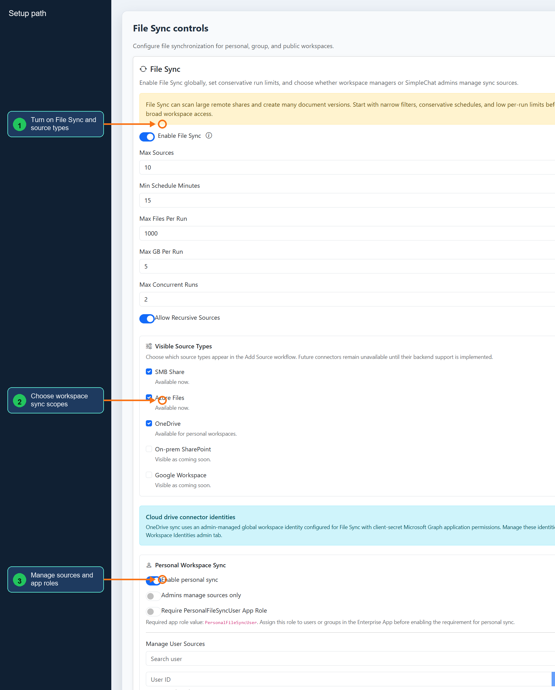

1. Open **File Sync** and enable the connector, visible source types, and the workspace scopes where synced files may appear.
2. Configure personal, group, and public workspace sync behavior before creating sources so each source lands in the correct ownership model.
3. Use **Manage File Sync Sources** and **File Sync App Role Setup** to create source definitions and app roles, then run a sync and verify badges, history, and imported documents.

### Global Identity

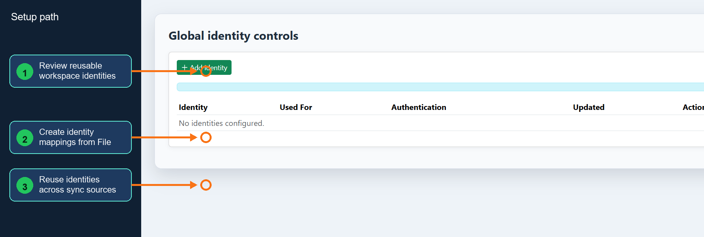

1. Open **Workspace Identities** to review reusable identities that File Sync and workspace connectors can share across sources.
2. Create or update identity mappings when multiple sync sources should use the same managed identity, app registration, or delegated access profile.
3. Save the identity configuration, return to File Sync, and assign the identity to a source before running the connector test or sync job.

### Citations

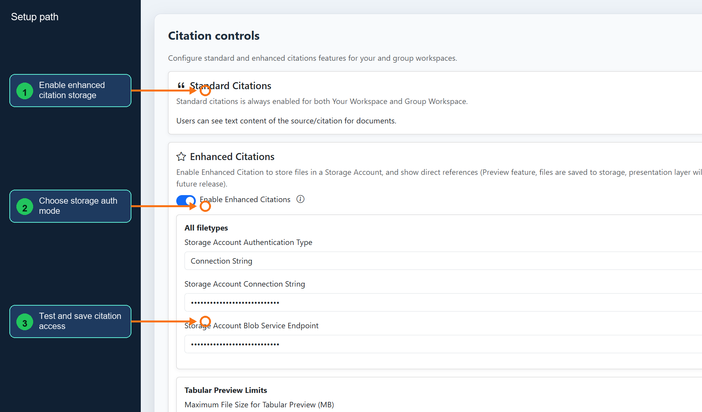

1. Open **Citations** and enable enhanced citations when users need direct file preview, source documents, or richer citation playback.
2. Configure Azure Storage using either connection string or managed identity endpoint, then test access before saving.
3. Upload or reprocess a document after saving and confirm chat citations can open the expected preview or source reference.

### Safety

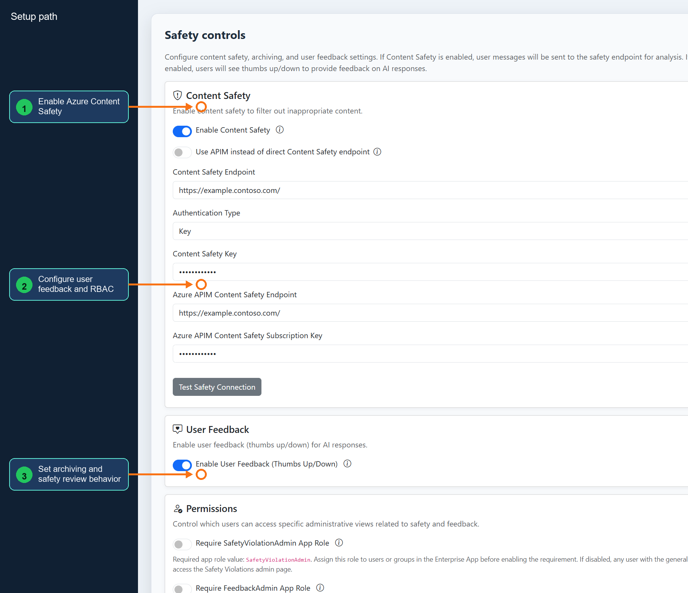

1. Open **Safety** and configure Azure Content Safety endpoint routing, authentication, and connection testing before enabling filtering for users.
2. Enable user feedback, safety violation admin role enforcement, and feedback admin role enforcement according to your review process.
3. Configure conversation archiving versus deletion, save, and verify that feedback and safety review pages respect the selected RBAC controls.

### Security

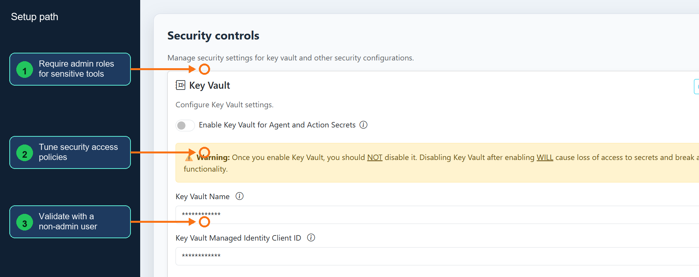

1. Open **Security** and review any role-gated or secret-management settings that control access to sensitive admin tools.
2. Enable required app roles before turning on enforcement, then assign those roles in Entra ID to the admin groups that need access.
3. Save and validate with both an authorized admin and a normal user so restricted views remain reachable only to the intended audience.

### Search And Extract

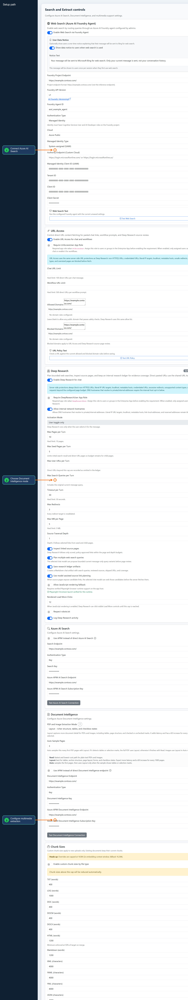

1. Open **Search and Extract** and configure Web Search, URL Access, and Deep Research only for deployments where admins have approved outbound source review behavior.
2. Configure Azure AI Search and Document Intelligence endpoints, select Read, Layout, or Auto extraction mode, and test each connection.
3. Set chunk sizes and multimedia extraction services such as Video Indexer and Speech, then upload a document or media file to confirm extraction, indexing, and citation behavior.

### Send Feedback

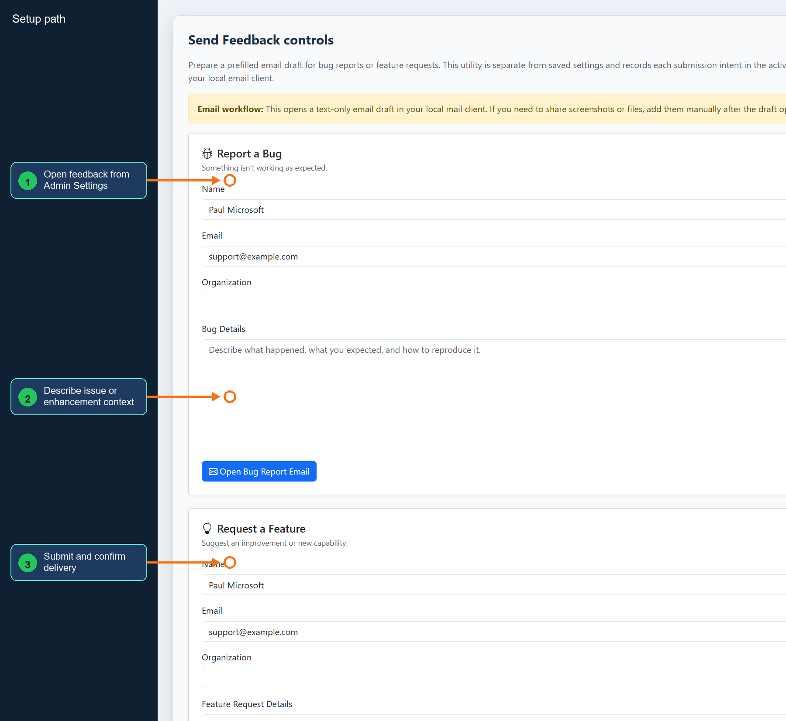

1. Open **Send Feedback** from Admin Settings or the Support menu after the Support destination is enabled in General.
2. Enter the issue, enhancement request, or operational context with enough detail for admins to reproduce or triage it.
3. Submit the feedback and confirm it arrives through the configured support recipient or review workflow.

## Navigation Options

The Admin Settings page supports two navigation layouts:

1. **Tab Navigation** (Default): Horizontal tabs at the top for switching between configuration sections
2. **Left Sidebar Navigation**: Collapsible left sidebar with grouped navigation items
   - Can be set as the default for all users in General → Appearance settings
   - Users can toggle between layouts individually
   - The Setup Walkthrough works seamlessly with both navigation styles

## Tips for Configuration

- **Save Changes**: The floating "Save Settings" button in the bottom-right becomes active (blue) when you make changes
- **Test Connections**: Use the "Test Connection" buttons to verify your service configurations before saving
- **APIM vs Direct**: When using Azure API Management (APIM), you'll need to manually specify model names as automatic model fetching is not available
- **Managed Identity**: When using Managed Identity authentication, ensure your Service Principal has the appropriate roles assigned:
  - **Azure OpenAI**: Cognitive Services OpenAI User role
  - **Model Endpoints**: Azure OpenAI multi-endpoint discovery also needs Reader on the Azure OpenAI resource. Foundry (classic) and New Foundry endpoints need Foundry User, or Azure AI User where older role names are still shown, on the target project or backing Foundry resource. See [Configure Model Endpoint Identity]({{ '/how-to/model_endpoint_identity_setup/' | relative_url }}).
  - **Speech Service**: Start with `Cognitive Services Speech User`; add `Cognitive Services Speech Contributor` if transcription operations still require it. Managed identity also requires the custom-domain Speech endpoint, and text-to-speech needs the Speech Resource ID.
  - **Video Indexer**: Grant the App Service system-assigned managed identity `Contributor` on the Video Indexer resource. If Azure asks for a user-assigned managed identity during Video Indexer resource creation, that identity is for the Video Indexer resource itself, not for Simple Chat runtime calls.
- **Dependencies**: The walkthrough will alert you if required services aren't configured when you enable dependent features (e.g., workspaces require embeddings, AI Search, and Document Intelligence)
- **Required vs Optional**: The walkthrough clearly indicates which settings are required vs optional based on your configuration choices